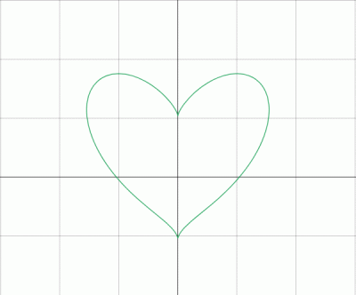
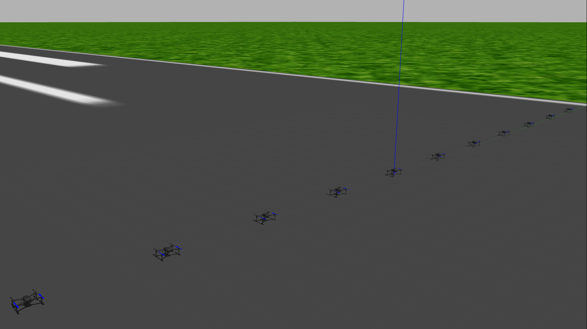
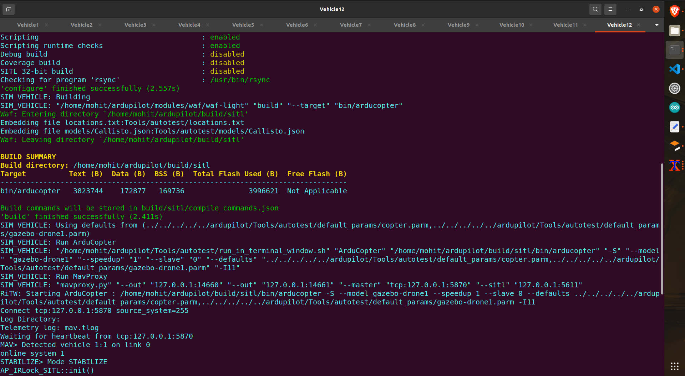
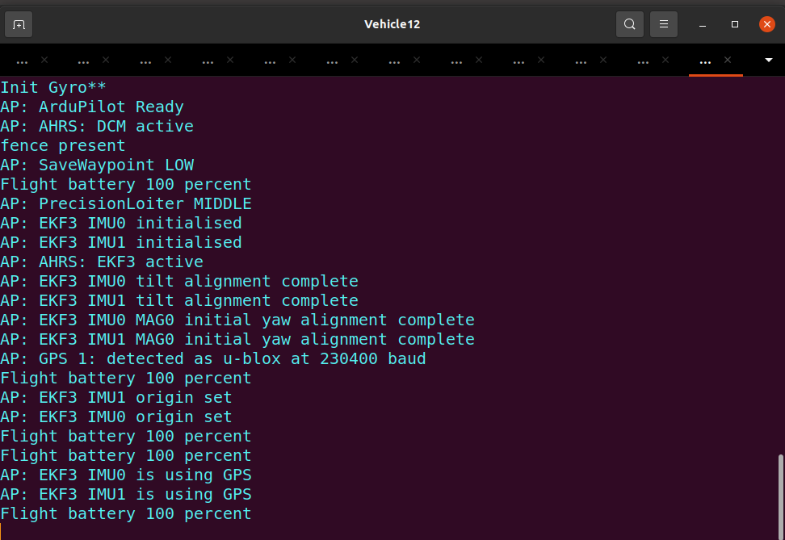

# Pattern data generation & Drone Swarming Simulation    
## Pattern data generation :    
<div align="center">
  
</div>


## Pattern formation :    

https://github.com/ab31mohit/drone_swarming/assets/99829827/8cf5f853-6560-40ba-8c4e-d0e5fcbfdb2c

---   

## Setup requirements :    
- ubuntu 20.04 LTS Desktop version
- ros-noetic-desktop-full
- python 3.7+

---
## Setup & Installations 

### 1. Install Ardupilot and MAVProxy for Ubuntu 20.04 :

- Clone ArduPilot in home directory
```
cd ~
sudo apt install git
git clone https://github.com/ArduPilot/ardupilot.git
cd ardupilot
```

- Install dependencies
```
cd ardupilot
Tools/environment_install/install-prereqs-ubuntu.sh -y
```

- Reload profile 
```
. ~/.profile
```

- Checkout Latest Copter Build
```
git checkout Copter-4.2
git submodule update --init --recursive
```

- Run SITL (Software In The Loop) once to set params:
```
cd ~/ardupilot/ArduCopter
sim_vehicle.py -w
```

### 2. Install Gazebo plugin for APM (ArduPilot Master) :
- Clone the the repo in home directory
```
cd ~
git clone https://github.com/khancyr/ardupilot_gazebo.git
cd ardupilot_gazebo
```

- build and install plugin
```
mkdir build
cd build
cmake ..
make -j4
sudo make install
```

- write sourcing command in `.bashrc` file
```
echo 'source /usr/share/gazebo/setup.sh' >> ~/.bashrc
```
- Set paths for models:
```
echo 'export GAZEBO_MODEL_PATH=~/ardupilot_gazebo/models' >> ~/.bashrc
. ~/.bashrc
```
### 3. Setting up the workspace :  
- Create a ROS workspace to run this package in home directory
```
cd
mkdir -p drone_ws/src
cd drone_ws/src
git clone https://github.com/ab31mohit/drone_swarming.git
cd ..
catkin_make
```

- Write sourcing command to `.bashrc` file
```
echo "source ~/drone_ws/devel/setup.bash" >> ~/.bashrc
source ~/.bashrc
```

- Copy & paste the contents of `models_drones` folder to `/home/username/.gazebo/models` directory. In case you don't have a *models* folder inside *.gazebo* folder then create one and then paste the contents into that.    

- Copy & paste the contents of `default_params` folder to `home/username/ardupilot/Tools/autotest/default_params` directory.   

- Replace `/home/username/ardupilot/Tools/autotest/pysim/vehicleinfo.py` file with *vehicleinfo.py* (present in this repository) file.

- Change the ***path*** variables in `generatePattern.py`, `master.py`, `patternFormation.sh` according to you system.

---

## Running the Package : 

- First check if everything is working or not by running following command in the terminal  
```
roslaunch drone_swarming drone1to12_line.launch  
```

It should open the following world in gazebo    
<div align="center">
  
</div>


- Open a new tab of the terminal and run
```
roscd drone_swarming/SITL\ config
bash ./startSITL.sh
```
It should open a new terminal window with 12 tabs like this    
<div align="center">
  
</div>

If the above 2 steps are successfull on your system then setup is done. You can close the 2 processes for now.    
First step for drone swarming is to generate the target data for each drone to follow for pattern formation.    
Below are the steps for same.

- Install the required python libraries by running the command    
```
roscd drone_swarming/
pip3 install -r requirements.txt
```
- To Run the scripts for generating Pattern Points run the *generatePattern.py* script    
(assuming you have already changed the path variables in the script files as told in above steps)
```
roscd drone_swarming/patternFormation/scripts/
python3 generatePattern.py
```
This script will use the image as input present in `input_image` folder.    
It will prompt for you writing the json filename to store the data coordinate data of points for pattern formation. Write the filename & then press enter.    
The json file will be stored inside `pattern_data_output` folder.   
    
Second and final step is to launch world file, run sitl and bash files.    
Below are the steps for same.    

- Launch the world file
```
roslaunch drone_swarming drone1to12_line.launch
```

- Start SITL
```
roscd drone_swarming/SITL\ config
bash ./startSITL.sh
```

Now wait for some time until the GPS is detected. It should show the following lines    
<div align="center">
  
</div>

- Now open a new tab in the old terminal window and run
```
roscd drone_swarming/patternFormation/scripts/
python3 master.py
```

It will prompt you for specifying the json file whose pattern you want to generate.
This will publish the coordinate data of points saved in the above json file as the target points for each drone in respective ros topics - `/D1`, `/D2` and so on.

- Open a new tab of the terminal and run
```
roscd drone_swarming/patternFormation/scripts/
bash ./patternFormation.sh
```

## Note:    
For using this package for some another pattern, please follow the same image styles as being used in the `image_input` folder. These images are being generated using desmos and the mask values for image processing operations are set according to these styles only. For using some other color or type of image, please change the parameters in the ***PatternClass.py*** module.
